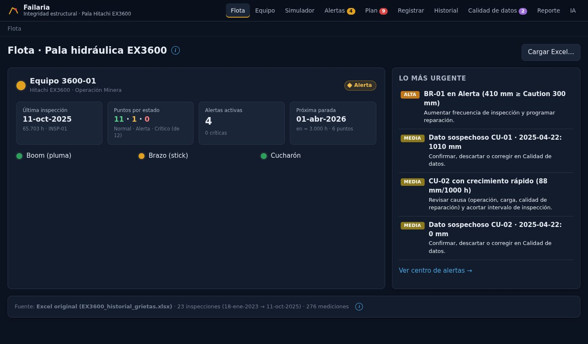
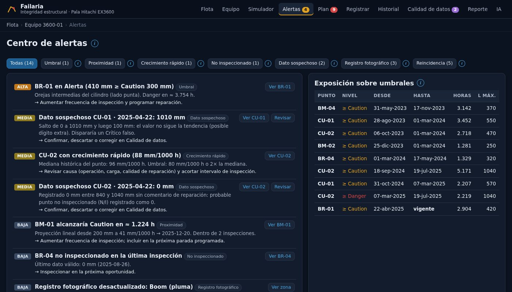
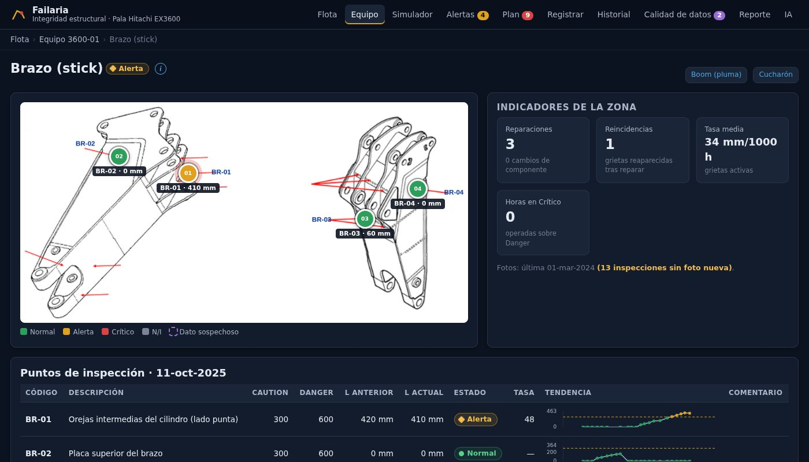
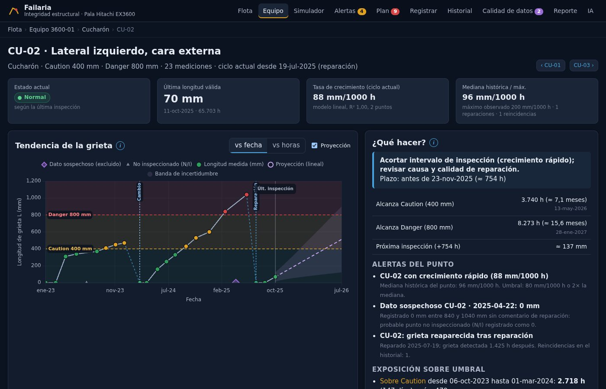
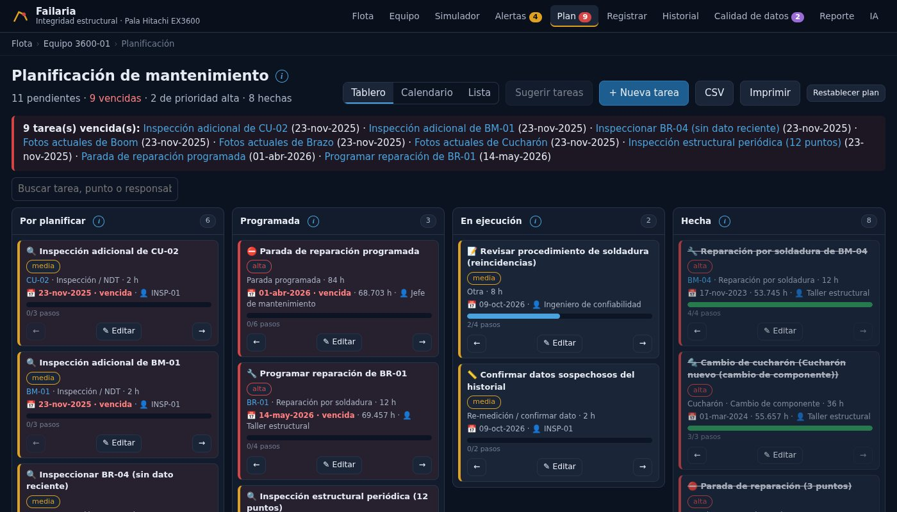
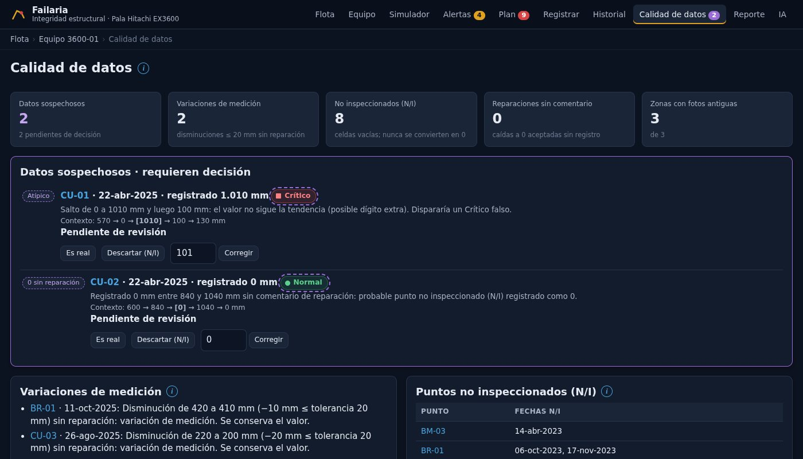
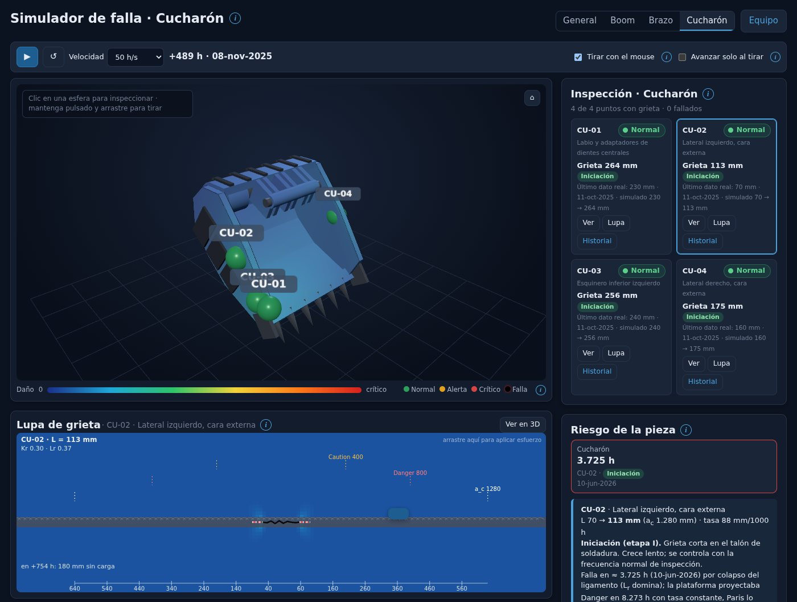

# Failaria

**Plataforma web de integridad estructural y mantenimiento basado en condición** para la pala hidráulica Hitachi EX3600 (equipo 3600-01).

Failaria convierte el historial de inspecciones de grietas en decisiones de mantenimiento: qué punto reparar primero, cuándo detener el equipo, qué datos de campo no son confiables y **cuándo y cómo fallaría cada pieza** si no se interviene. Reúne en una sola herramienta el seguimiento de grietas por punto, las alertas por umbral, un simulador de falla por fatiga con modelo 3D, la planificación de tareas y el reporte de inspección.

Es una aplicación web que corre completa en el navegador, sin servidor, base de datos ni instalación. Funciona en PC y en tablet.

Taller en Énfasis II — Gestión de Mantenimiento · Grupo 5


## Cómo abrirla

| Opción | Para qué | Pasos |
|---|---|---|
| **Versión entregable** | Entrega y evaluación en cualquier PC | Doble clic en `Failaria.html`. Es un solo archivo con todo adentro: código, librerías, Excel e imágenes. No necesita internet, Python, servidor ni GitHub. |
| Desde el código fuente | Desarrollo | Doble clic en `iniciar.bat` (Windows, requiere Python) o `python -m http.server 8000` en esta carpeta → `http://localhost:8000`. |
| Link público (opcional) | Compartir por URL | Publicar la carpeta en GitHub Pages o Netlify (ver [docs/ENTREGA.md](docs/ENTREGA.md)). |

Abrir `index.html` con doble clic no funciona, porque los navegadores bloquean los módulos JavaScript en `file://`; la página lo avisa. Los datos se cargan solos desde `data/EX3600_historial_grietas.xlsx`, y **Flota → Cargar Excel…** acepta otro historial con las mismas hojas.

### Generar la versión entregable

```bash
node herramientas/empaquetar.mjs
```

| Archivo generado | Contenido |
|---|---|
| `Failaria.html` | La plataforma completa en un archivo (≈ 6 MB), en la raíz del repositorio |
| `dist/Failaria_entrega.zip` | `Failaria.html` + `LEEME.txt`, para plataformas o correos que no aceptan `.html`; no se versiona |

Requiere Node 18 o superior. La primera vez necesita internet, porque `npx` descarga esbuild para agrupar el código. La plataforma en sí no usa npm. Hay que regenerar el archivo después de cada cambio. Para entregar en Teams o en el aula virtual se adjunta `Failaria.html` o el ZIP, no el link del repositorio. Detalle, verificación y opciones de publicación en [docs/ENTREGA.md](docs/ENTREGA.md).

## Cómo está pensada la interfaz

Cada vista muestra solo lo necesario para decidir. Las explicaciones (reglas, supuestos, cómo leer un gráfico) están detrás del icono **ⓘ** junto a cada título o control: pulsarlo abre una ventana con el detalle y `Esc` la cierra. Así la pantalla sirve en una tablet en terreno y el texto didáctico sigue disponible.

## Qué decisión responde cada vista

| Vista | Pregunta | Qué hay |
|---|---|---|
| **Flota** | ¿Qué equipo necesita atención primero? | Semáforo por equipo, lo más urgente, carga de Excel |
| **Equipo** | ¿En qué estado está la pala, qué reparo primero y cuándo paro? | KPIs, 3D por estado, «¿qué pasa si…?», plan priorizado, próxima parada |
| **Simulador** | ¿Cuándo y cómo fallaría cada pieza según la gravedad de su grieta? | Tiempo real con ley de Paris, mapa de daño tipo FEA, grietas a escala, FAD, **tirar de la estructura con el mouse**, reporte de esfuerzo y **causa de la falla** (horas de uso o fuerza excesiva) |
| **Plan** | ¿Qué hago, cuándo y quién? | Tablero tipo Trello (Por planificar → Programada → En ejecución → Hecha), calendario, tareas sugeridas desde alertas y plan, pasos de verificación, CSV |
| **Zona** | ¿Dónde están las grietas y cuál requiere acción? | Esquema con puntos clicables por estado, mini-tendencias, fotos |
| **Punto** | ¿Cómo evoluciona esta grieta y cuándo cruza los umbrales? | Tendencia vs fecha/horas, bandas, ciclos de reparación, proyección, fotos |
| **Alertas** | ¿Qué requiere acción hoy? | Umbral, proximidad, crecimiento rápido, N/I, dato sospechoso, fotos; «¿qué habría advertido la plataforma?» |
| **Registrar** | Formulario con la estructura del formato Word | L anterior automática, estado en vivo, avisos de digitación, fotos |
| **Historial** | Consulta y exportación | Filtros, Excel/CSV/JSON |
| **Calidad de datos** | ¿Qué datos de campo no son confiables? | Marcados, no borrados; el usuario decide |
| **Reporte** | PDF en el orden del formato | Resumen, plan, zonas, alertas, diagnóstico IA |
| **IA** | Diagnóstico asistido | Diagnóstico incluido, prompt estructurado o llamada a la API de Claude |

## Galería

| | |
|---|---|
|  **Flota:** semáforo por equipo y lo más urgente |  **Alertas:** qué requiere acción hoy y exposición sobre umbrales |
|  **Zona:** esquema con puntos clicables por estado |  **Punto:** tendencia, umbrales, proyección y qué hacer |
|  **Plan:** tablero de tareas sembrado desde el historial |  **Calidad de datos:** datos sospechosos marcados, decide el usuario |

## Simulador de falla


- ▶ hace avanzar las 12 grietas con la **ley de Paris** calibrada con la tasa medida de cada punto, hasta la longitud crítica `a_c = 1,6 × Danger`.
- El color de la estructura (azul → rojo) muestra **dónde y cuánto se agrava** el daño.
- **Mantener pulsado sobre el boom, brazo o cucharón y arrastrar** aplica un sobreesfuerzo: la cámara queda fija, aparece la flecha, los puntos cercanos crecen `(1+s)^m` veces más rápido y la zona queda con daño permanente. Un punto sano puede iniciar grieta.
- Panel: pieza en riesgo por zona, tabla por gravedad y modo de falla, diagrama FAD y eventos.
- **Reporte de esfuerzo y falla:** horas sobrecargado, sobreesfuerzo medio y máximo, dosis de daño y mm de crecimiento por tiempo frente a sobrecarga. Al fallar indica la causa: *por horas de uso*, *fatiga acelerada por sobrecargas* o *fractura por fuerza excesiva* (súbita, al cruzar el FAD).
- Modelo 3D paramétrico de la EX3600 según los esquemas de inspección: boom curvo con pie bifurcado y soportes de cilindros, brazo ahusado con orejas en abanico, cucharón con rejillas de desgaste y bujes, cilindros con vástago, tren de rodaje con zapatas.
- **Modo por pieza** (General · Boom · Brazo · Cucharón) con panel de inspección punto a punto y **lupa de grieta**: vista cercana con el campo de tensión, la zona plástica y la evolución prevista con y sin esfuerzo; arrastrar sobre la lupa carga solo ese punto.



## Planificación de mantenimiento

La vista **Plan** arranca con un plan inicial construido desde el historial (reparaciones y cambios registrados como tareas hechas, recomendaciones vigentes programadas con responsable, revisión de soldadura y datos sospechosos en ejecución) y lleva a la práctica lo que la plataforma recomienda: «Sugerir tareas» crea tarjetas desde la próxima parada, el plan priorizado y las alertas (reparación con pasos de soldadura y NDT, inspección adicional, re-medición, fotos, inspección periódica). Tablero con arrastrar y soltar o flechas, calendario mensual, lista imprimible, responsable, horómetro previsto, pasos de verificación y exportación CSV. Las fechas salen de las horas proyectadas, igual que la próxima parada de la vista Equipo; si una fecha ya pasó, la tarea queda vencida en vez de moverse a hoy. Las tareas vencidas se marcan y aparecen en el reporte.

Uso detallado: [docs/SIMULADOR.md](docs/SIMULADOR.md). Fundamentos (supervisión de grietas, Paris, FAD, límites): [docs/MANTENIMIENTO_Y_FALLA.md](docs/MANTENIMIENTO_Y_FALLA.md).

## Hallazgos que la plataforma hace evidentes

| Hallazgo | Dato |
|---|---|
| CU-02 operó ≈ 4 meses en Crítico | 840 mm el 07-mar-2025 → reparado 19-jul-2025 (2 219 h). La alerta habría salido el mismo día |
| BR-01 en Alerta | 410 mm, 48 mm/1000 h → Danger en ≈ 3 750 h (lineal) o ≈ 2 970 h (Paris); parada ≈ abr-2026 |
| BM-01 llega a Caution en ≈ 1 200 h | BM-01/02/03 crecen en paralelo desde mar-2025 |
| Primera pieza en fallar sin intervención | Cucharón por CU-02: la grieta más rápida (88 mm/1000 h) alcanza `a_c` en ≈ 4 200 h |
| Reincidencias tras reparación | BM-02, BM-03, BM-04, BR-03, CU-01, CU-02 → revisar soldadura |
| Calidad de datos | CU-01 = 1010 mm (dígito extra, sugerido 101), CU-02 = 0 sin reparación (probable N/I), fotos de 2024 reutilizadas |

## Reglas de decisión

- Estado según la hoja **Puntos**: Normal L < Caution · Alerta Caution ≤ L < Danger · Crítico L ≥ Danger · vacío = **N/I** (nunca 0).
- Reparación o cambio de componente **reinicia el ciclo**; tendencias y proyecciones usan solo el ciclo actual.
- Proyección: regresión sobre horas (exponencial solo si mejora R² en 0,05), banda ±2σ; fechas = horas / utilización histórica (≈ 17,4 h/día).
- Falla: ley de Paris por tramos (régimen de grieta corta hasta `max(L, Caution/2)`), `a_c = 1,6 × Danger`, FAD circular. Parámetros en [`src/config.js`](src/config.js) (`falla`).

## Estructura

```text
index.html            shell (navegación por vistas)
src/config.js         parámetros, hotspots, posiciones 3D, parámetros de falla
src/datos.js          Excel → modelo normalizado, validación de calidad, exportación   (sin DOM)
src/reglas.js         estado, ciclos, tasas, proyección, alertas, plan, KPIs          (sin DOM)
src/falla.js          ley de Paris, longitud crítica, modos, FAD, simulación, causa de falla (sin DOM)
src/tareas.js         planificación: sugerencias, tablero, agenda, CSV                   (sin DOM)
src/almacen.js        localStorage, respaldo JSON, fotos
src/ia.js             prompt estructurado + API de Claude  ·  src/diagnostico_ia.js  diagnóstico IA incluido
src/vistas/*.js       flota, equipo, simulador, planificacion, zona, punto, registrar, historial, alertas, calidad, reporte, ia
src/ui/ayuda.js       icono ⓘ con información adicional
src/ui/pala3d.js      pala 3D paramétrica (vigas lofteadas)  ·  src/ui/simulador3d.js  mapa FEA + tirar con el mouse
src/ui/grafico.js     Chart.js  ·  src/ui/esquema.js  esquemas con hotspots
src/ui/lupa.js        lupa de grieta  ·  src/ui/formato.js  formatos y recurso(): rutas de imágenes y Excel
vendor/               SheetJS, Chart.js + annotation, Three.js, OrbitControls (versiones fijas)
herramientas/         empaquetar.mjs: genera la versión entregable Failaria.html (raíz) y el ZIP (dist/, ignorada por git)
Failaria.html         versión entregable generada; no editar a mano
docs/                 README (índice), ENTREGA, MANTENIMIENTO_Y_FALLA, SIMULADOR, USO_IA, historial/, referencia/, capturas/
tests/verify.cjs      95 verificaciones de datos.js, reglas.js, falla.js, tareas.js y del diagnóstico incluido
```

## Verificación

```bash
node tests/verify.cjs              # lógica: 95 verificaciones
node herramientas/empaquetar.mjs   # versión entregable: Failaria.html y dist/Failaria_entrega.zip
```

La versión entregable se probó abriéndola como archivo local en Chromium, sin carpetas al lado: todas las vistas cargan con datos, imágenes y 3D, sin errores de consola.

## Persistencia y privacidad

Inspecciones registradas, fotos, decisiones y tareas se guardan en el navegador del equipo donde se abre la plataforma (`localStorage`, clave `ex3600.v1`); no salen del equipo. Respaldo: **Historial → Respaldo JSON** o **Exportar Excel**. La clave de API para la IA solo se guarda si el usuario lo pide, y solo en su navegador.

Documentación completa: [docs/README.md](docs/README.md). Uso de IA en el desarrollo: [docs/USO_IA.md](docs/USO_IA.md).
